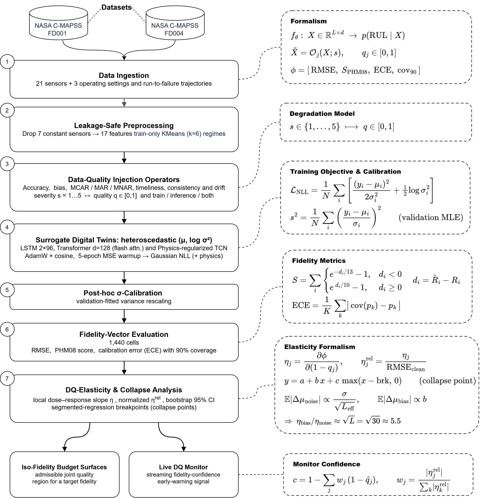

# DQ4DT: Data-Quality Elasticity for Digital-Twin Prognostics

A benchmark and metric framework for measuring how sensor data quality affects the reliability of digital-twin prognostic models.

DQ4DT treats data quality as a measurable design parameter rather than a precondition. It injects eight kinds of controlled degradation into sensor windows, measures a four-component fidelity vector (RMSE, PHM08 score, calibration error, interval coverage), and reports the **data-quality elasticity**: the rate at which fidelity falls as quality falls. The framework also locates collapse points, tests architecture fragility signatures, and turns the results into quality budgets and a live monitor.

This repository contains the full pipeline, the exact results reported in the paper, and the figures. Everything is resumable, seeded, and tested.



## What is in the paper

Across NASA C-MAPSS FD001 and FD004, three surrogate architectures (LSTM, transformer, physics-regularized TCN), and 1,440 evaluation cells:

| Finding | Result |
|---|---|
| Invariant collapse point for informative missingness | 1 − q = 0.390 (FD001) vs 0.388 (FD004) |
| Bias dominates zero-mean noise | up to 7× on FD001, matches a closed-form √L bound |
| Informative (MNAR) dominates random (MCAR) missingness | roughly 4 to 8× on both datasets |
| Regime-dependent danger ranking | consistency and drift dominate on multi-regime FD004 |
| Architecture fragility signatures | 12 of 12 pre-registered tests confirmed |
| MNAR × timeliness interaction | sub-additive, Holm-corrected p = 0.0156 |
| Lifecycle asymmetry | training immunizes against bias, is poisoned by MNAR |
| Silent interval decalibration | 90% coverage decays 0.86 → 0.58 |

A quality-conditioned gating mechanism was also tested and produced a clean null result. It is included so the ablation can be reproduced.

## Repository layout

```
dq4dt/            Python package
  config.py         experiment configuration (DEFAULT_CONFIG reproduces the paper)
  data.py           C-MAPSS download, leakage-safe preprocessing
  injectors.py      the eight degradation operators
  models.py         LSTM, transformer, physics-regularized TCN, optional gate
  metrics.py        losses, fidelity-vector metrics, sigma calibration
  stats.py          Holm correction, effect sizes, segmented regression
  training.py       resumable training loop and model cache
  sweep.py          the main degradation sweep
  analysis.py       elasticity, breakpoints, interactions, signatures, studies
  monitor.py        live data-quality monitor
  plotting.py       publication figures
scripts/          command-line entry points
notebooks/        the original Colab notebook used for the paper
results/          all result CSVs and LaTeX/HTML/CSV tables from the paper run
figures/          all figures from the paper (PDF and PNG)
docs/             methodology, reproduction guide, results summary
tests/            unit tests (CPU only, no data needed)
```

## Quick start

```bash
git clone https://github.com/<your-org>/dq4dt.git
cd dq4dt
pip install -r requirements.txt
pip install -e .
python -m pytest tests/        # 41 tests, about a minute on CPU
```

### Use the operators and metrics without any data

```python
import torch
from dq4dt import degrade, INJECTORS, fit_sigma_scale, coverage

x = torch.randn(32, 30, 17)            # batch of sensor windows
g = torch.Generator().manual_seed(0)
x_bad, q = degrade(x, "completeness_MNAR", severity=4, gen=g)
print(q.mean())                        # per-channel quality estimate
```

### Recompute the paper's analysis from the released results (CPU, seconds)

```bash
python scripts/analyze_results.py --sweep results/sweep_results_v3.csv
python scripts/make_figures.py --results results --out figures/regenerated
```

### Run the full benchmark (GPU, about 4 to 8 hours)

```bash
python scripts/run_benchmark.py --root ./runs/full
```

The command downloads C-MAPSS from a public mirror on first use, trains every model, runs the sweep and all follow-up studies, and writes CSVs into `./runs/full`. It resumes at model and block granularity, so it can be interrupted and restarted freely. Add `--quick` for a one-hour smoke test on FD001 only.

## Configuration

`dq4dt/config.py` holds every knob. The defaults reproduce the paper. To add the remaining C-MAPSS subsets:

```python
from dq4dt.config import Config
cfg = Config(subsets=["FD001", "FD002", "FD003", "FD004"])
```

## Reproducibility notes

- All random seeds are fixed. Model checkpoints are keyed by (subset, model, seed, gate, tag).
- Scalers and regime clusters are fit on training data only. Splits are engine-level.
- The released results were produced on a single NVIDIA L4 with PyTorch 2.x in bfloat16. Small numerical differences on other hardware are expected; the orderings and the collapse point should not change.
- `scripts/analyze_results.py` reproduces the elasticity table from the released sweep to machine precision.

See `docs/reproducing.md` for the full walk-through and `docs/methodology.md` for the formal definitions.

## Data

C-MAPSS is public domain (NASA Prognostics Center of Excellence). The loader tries the NASA Open Data Portal, then a PHM Society mirror, then a GitHub mirror. If all fail, download the twelve text files manually and place them in `data/CMAPSSData/`.

## Citation

If you use this code or the benchmark, please cite the paper (see `CITATION.cff`). A preprint and DOI will be added on publication.

## License

MIT. See `LICENSE`.
